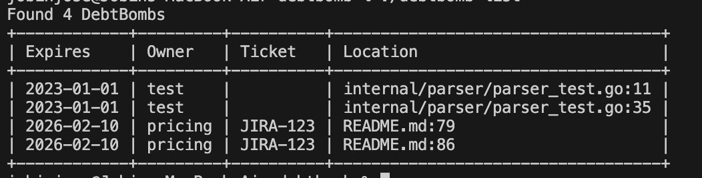

# DebtBomb

DebtBomb is a cross-language technical-debt enforcement engine that scans source code comments for time-limited "debt bombs" and fails CI if any have expired.

It helps teams manage technical debt by allowing developers to set expiration dates on TODOs or temporary hacks directly in the code. When the date passes, DebtBomb "explodes" (fails the build), forcing the team to address the debt.



## Installation

### Using Go Install

```bash
go install github.com/jobin-404/debtbomb/cmd/debtbomb@latest
```

#### PATH Configuration

If the `debtbomb` command is not recognized, add the Go binary directory to your system's PATH:

**macOS / Linux:**
```bash
echo 'export PATH="$HOME/go/bin:$PATH"' >> ~/.zshrc # or ~/.bashrc
source ~/.zshrc
```

**Windows:**
Add `%USERPROFILE%\go\bin` to your PATH environment variable.

### Building from Source

```bash
git clone https://github.com/jobin-404/debtbomb.git
cd debtbomb
go build -o debtbomb cmd/debtbomb/main.go
```

## Usage

### CI Integration

Add DebtBomb to your CI pipeline to prevent expired technical debt from merging.

```bash
# Fails with exit code 1 if any debt bomb has expired
debtbomb check
```

### Warning Mode

You can warn developers about upcoming debt expirations without failing the build:

```bash
# Warns about bombs expiring within the next 7 days
debtbomb check --warn-in-days 7
```

### Listing Debt

View a report of all technical debt in the project:

```bash
# List all debt bombs sorted by expiration date
debtbomb list

# List only expired bombs
debtbomb list --expired

# Output in JSON format (useful for custom tooling)
debtbomb list --json
```

## Syntax

DebtBomb scans for comments containing `@debtbomb`. It supports various comment styles (`//`, `#`, `--`, `/*`) and works with any file type.

### Single-line Style
Compact format using parentheses.

```go
// @debtbomb(expire=2026-02-10, owner=pricing, ticket=JIRA-123)
```

### Multi-segment Style
More readable format using separators.

```go
// @debtbomb // expire: 2026-02-10 // owner: pricing // ticket: JIRA-123 // reason: Temporary surge override
```

### Fields

- `expire` (Required): Expiration date in `YYYY-MM-DD` format.
- `owner` (Optional): Team or individual responsible.
- `ticket` (Optional): Issue tracker reference (e.g., JIRA-123).
- `reason` (Optional): Context on why this debt exists.

## Configuration

### Ignore Files (.debtbombignore)

To exclude specific files or directories from the scan, create a `.debtbombignore` file in your project root. The syntax is similar to `.gitignore`.

Example `.debtbombignore`:
```text
# Ignore migrations folder
migrations/

# Ignore legacy code
legacy/

# Ignore specific generated files
src/generated/*.go
```

### Automatic Exclusions

DebtBomb is optimized for large repositories and automatically ignores:

**Directories:**
- Dependencies: `node_modules`, `vendor`, `.venv`, `__pycache__`, etc.
- Build Artifacts: `dist`, `build`, `out`, `target`, `bin`, `pkg`, `obj`, etc.
- Version Control: `.git`, `.svn`, `.hg`
- IDE/Tooling: `.idea`, `.vscode`, `.terraform`
- Media/Assets: `images`, `assets`, `public`

**Files:**
- Binary files (images, videos, executables, archives)
- Documents (PDF, Office)
- Minified code (`.min.js`, `.min.css`)
- Lock files (`.lock`)
- **Large files**: Any file larger than 1MB is skipped automatically.

## License

MIT